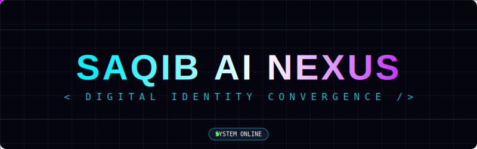

<div align="center">
  

  <br />
  <br />


  
  
  
  
  

  <br />

  <h1 style="font-size: 3rem; margin-top: 20px;">SAQIB AI NEXUS</h1>
  
  <p style="font-size: 1.2rem; color: #a1a1aa;">
    <i>Where Artificial Intelligence Converges to Form Identity.</i>
  </p>
  
  <p>
    <a href="https://saqib-ai-nexus.vercel.app/"><strong>Explore the Live Demo »</strong></a>
    <br />
    <br />
    <a href="#features">Features</a>
    ·
    <a href="#deployment">Deployment</a>
    ·
    <a href="#issues">Report Bug</a>
  </p>
</div>

<br />

## ⚡ Overview

**Saqib AI Nexus** is a next-generation portfolio concept that visualizes the digital formation of an identity. 

Instead of a static page, users are greeted by **Two Intelligent AI Agents** (represented by Blue and Orange energy streams) that swirl in a DNA-like helix. As they pass through the canvas, they "write" the name **SAQIB** using thousands of reactive particles.

## 🚀 Key Features

| Feature | Description |
|---------|-------------|
| **🧬 Twin AI Agents** | Autonomous agents that move in complex Lissajous curves, leaving light trails. |
| **✨ Reactive Particles** | Thousands of particles that form text and scatter realistically when interacted with via mouse. |
| **🎨 RGB Physics** | Particles are not static; they glow in sync with the passing agents, shifting colors dynamically. |
| **🤖 AI Chat Integration** | *Coming Soon:* A conversational interface to talk to the AI representation of Saqib. |
| **📱 Responsive Design** | Optimized for all screens with a mobile-first Cyberpunk UI. |

## 🛠️ Tech Stack

- **Core**: React 19, TypeScript
- **Styling**: Tailwind CSS (with custom animations)
- **Graphics**: HTML5 Canvas (2D Context)
- **AI Integration**: Google Gemini API (via `@google/genai`)
- **Build Tool**: Vite

## 📦 Installation

Clone the repository and install dependencies:

```bash
git clone https://github.com/your-username/saqib-ai-nexus.git
cd saqib-ai-nexus
npm install
```

Run the development server:

```bash
npm run dev
```

## 🌍 Deployment

### Vercel (Recommended)
This project is configured for Vercel.
1. Install Vercel CLI: `npm i -g vercel`
2. Run: `vercel`

### Netlify
1. Drag and drop the `dist` folder after running `npm run build`.
2. Or connect your Git repo (Settings are pre-configured in `netlify.toml`).

## 🤝 Contributing

1. Fork the Project
2. Create your Feature Branch (`git checkout -b feature/AmazingFeature`)
3. Commit your Changes (`git commit -m 'Add some AmazingFeature'`)
4. Push to the Branch (`git push origin feature/AmazingFeature`)
5. Open a Pull Request

---

<div align="center">
  <p>Made with ❤️ and 🤖 by Saqib</p>
</div>
